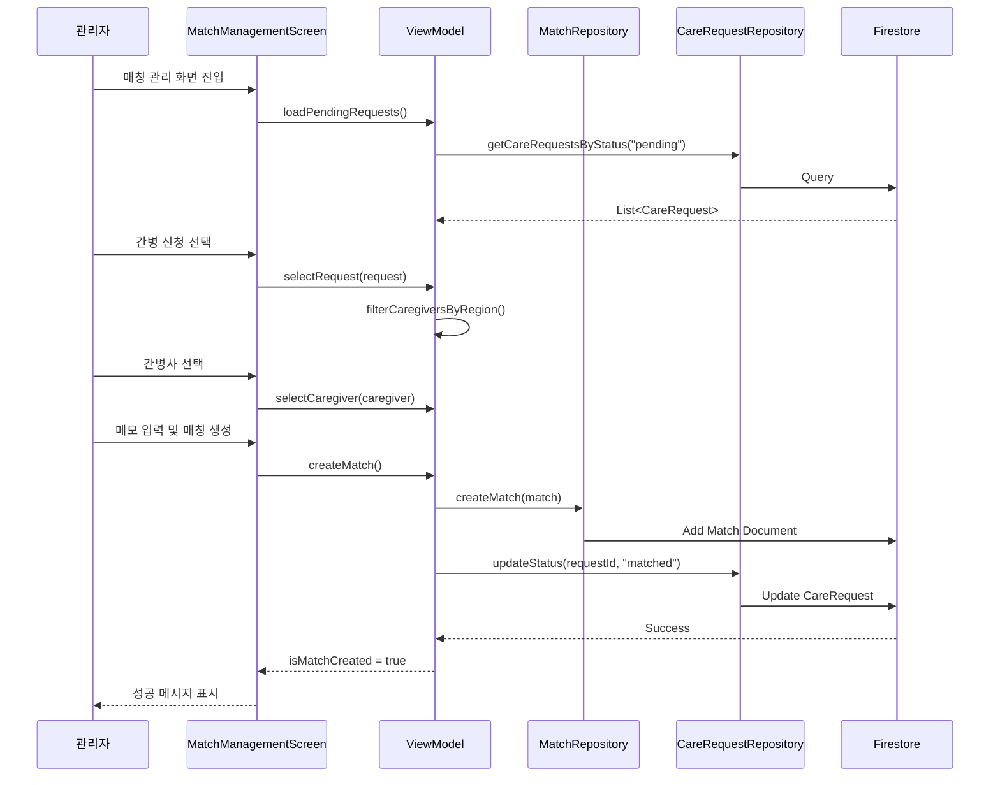

# 매칭 관리 화면 구현 계획

관리자가 간병 신청과 간병사를 매칭하고 매칭 상태를 관리할 수 있는 화면을 구현합니다.

## 📋 개요

### 목적
- 관리자가 pending 상태의 간병 신청을 확인하고 적합한 간병사를 매칭
- 매칭 생성 시 자동으로 간병 신청 상태를 "matched"로 업데이트
- 매칭 상태를 관리하고 추적

### 주요 기능
1. **간병 신청 선택**: pending 상태 신청 목록 표시
2. **간병사 선택**: 지역 기반 자동 필터링으로 적합한 간병사 추천
3. **매칭 생성**: 신청과 간병사를 연결하고 관리자 메모 추가
4. **상태 관리**: 매칭 상태 업데이트 (pending → confirmed → completed)

---

## 🗂️ 데이터 모델

### Match 데이터 모델

**파일**: `app/src/main/java/com/ezlevup/ganbyeong24/data/model/Match.kt`

```kotlin
import com.google.firebase.Timestamp

data class Match(
    val id: String = "",
    val careRequestId: String = "",
    val caregiverId: String = "",
    val status: String = "pending",  // pending, confirmed, completed, cancelled
    val notes: String = "",  // 관리자 메모
    val createdAt: Timestamp = Timestamp.now(),
    val updatedAt: Timestamp = Timestamp.now()
)
```

### Firestore 구조

**컬렉션**: `matches/{documentId}`

```json
{
  "id": "match123",
  "careRequestId": "request456",
  "caregiverId": "caregiver789",
  "status": "pending",
  "notes": "지역 일치, 경력 5년 이상",
  "createdAt": "2026-01-23T15:00:00Z",
  "updatedAt": "2026-01-23T15:00:00Z"
}
```

---

## 🏗️ 아키텍처

### Data Layer

#### MatchRepository
**파일**: `app/src/main/java/com/ezlevup/ganbyeong24/data/repository/MatchRepository.kt`

```kotlin
interface MatchRepository {
    suspend fun createMatch(match: Match): Result<String>
    suspend fun updateMatchStatus(matchId: String, status: String): Result<Unit>
    suspend fun getMatchById(matchId: String): Result<Match>
    suspend fun getAllMatches(): Result<List<Match>>
}
```

#### MatchRepositoryImpl
**파일**: `app/src/main/java/com/ezlevup/ganbyeong24/data/repository/MatchRepositoryImpl.kt`

- Firestore를 사용한 CRUD 구현
- `createMatch()`: 매칭 생성 및 CareRequest 상태 업데이트
- `updateMatchStatus()`: 매칭 상태 변경 및 updatedAt 업데이트

#### CareRequestRepository 확장
**파일**: `app/src/main/java/com/ezlevup/ganbyeong24/data/repository/CareRequestRepository.kt`

```kotlin
suspend fun updateCareRequestStatus(requestId: String, status: String): Result<Unit>
```

---

### Presentation Layer

#### MatchManagementState
**파일**: `app/src/main/java/com/ezlevup/ganbyeong24/presentation/screens/admin/match/MatchManagementState.kt`

```kotlin
data class MatchManagementState(
    val isLoading: Boolean = false,
    val currentStep: Int = 1,  // 1: 신청 선택, 2: 간병사 선택, 3: 확인
    val careRequests: List<CareRequest> = emptyList(),
    val caregivers: List<Caregiver> = emptyList(),
    val filteredCaregivers: List<Caregiver> = emptyList(),
    val selectedRequest: CareRequest? = null,
    val selectedCaregiver: Caregiver? = null,
    val notes: String = "",
    val errorMessage: String? = null,
    val isMatchCreated: Boolean = false
)
```

#### MatchManagementViewModel
**파일**: `app/src/main/java/com/ezlevup/ganbyeong24/presentation/screens/admin/match/MatchManagementViewModel.kt`

**주요 함수:**
- `loadPendingRequests()`: pending 상태 간병 신청 로드
- `loadCaregivers()`: 전체 간병사 로드
- `selectRequest(request: CareRequest)`: 신청 선택 및 간병사 필터링
- `selectCaregiver(caregiver: Caregiver)`: 간병사 선택
- `setNotes(notes: String)`: 관리자 메모 입력
- `createMatch()`: 매칭 생성
- `goToNextStep()` / `goToPreviousStep()`: 단계 이동

---

### UI Layer

#### MatchManagementScreen
**파일**: `app/src/main/java/com/ezlevup/ganbyeong24/presentation/screens/admin/match/MatchManagementScreen.kt`

**화면 구성:**

```
┌─────────────────────────────────────┐
│  매칭 관리                           │
│  [←]                         [1/3]  │
├─────────────────────────────────────┤
│                                     │
│  Step 1: 간병 신청 선택              │
│  ┌─────────────────────────────┐   │
│  │ 환자: 홍길동 (75세, 남성)    │   │
│  │ 지역: 서울                   │   │
│  │ 기간: 2026-01-24 ~ 01-31    │   │
│  │ 상태: 대기 중                │   │
│  └─────────────────────────────┘   │
│  ┌─────────────────────────────┐   │
│  │ 환자: 김영희 (68세, 여성)    │   │
│  │ ...                         │   │
│  └─────────────────────────────┘   │
│                                     │
│              [다음 →]               │
└─────────────────────────────────────┘
```

**Step 1: 간병 신청 선택**
- pending 상태 신청 목록 (LazyColumn)
- 각 카드: 환자명, 나이, 성별, 지역, 기간, 보호자 연락처
- 선택 시 하이라이트 표시

**Step 2: 간병사 선택**
- 간병사 목록 (LazyColumn)
- 선택된 신청의 지역과 일치하는 간병사 우선 표시
- 각 카드: 프로필 사진, 이름, 성별, 경력, 자격증, 가능 지역
- 지역 일치 여부 배지 표시

**Step 3: 매칭 확인 및 생성**
- 선택된 신청 정보 요약
- 선택된 간병사 정보 요약
- 관리자 메모 입력 필드 (TextField)
- "매칭 생성" 버튼

**성공 화면**
- 매칭 완료 메시지
- 생성된 매칭 정보 표시
- "목록으로 돌아가기" 버튼

---

## 🔄 데이터 흐름



---

## 🎨 UI/UX 설계

### 단계 표시기
- 상단에 진행 단계 표시 (1/3, 2/3, 3/3)
- 각 단계별 제목 표시
- 이전/다음 버튼으로 단계 이동

### 선택 상태 표시
- 선택된 카드: Primary Color 테두리
- 미선택 카드: Surface Color

### 지역 일치 표시
- 간병사 카드에 "지역 일치" 배지 표시
- 일치하는 간병사를 목록 상단에 표시

### 로딩 및 에러 처리
- 로딩 중: CircularProgressIndicator
- 에러 발생: Snackbar 또는 AlertDialog
- 빈 목록: 안내 메시지 표시

---

## 🧪 테스트 시나리오

### 1. 매칭 생성 플로우
1. 관리자 계정으로 로그인
2. 관리자 메뉴 → "간병 신청 관리" → "매칭 관리"
3. Step 1: pending 상태 신청 선택
4. Step 2: 간병사 선택 (지역 일치 확인)
5. Step 3: 메모 입력 및 "매칭 생성" 클릭
6. 성공 메시지 확인
7. Firebase Console에서 매칭 문서 확인
8. 간병 신청 상태가 "matched"로 변경되었는지 확인

### 2. 지역 필터링 테스트
1. 서울 지역 신청 선택
2. 간병사 목록에서 서울 가능 간병사가 상단에 표시되는지 확인

### 3. 단계 이동 테스트
1. Step 1에서 신청 선택 후 "다음" 클릭
2. Step 2에서 "이전" 클릭하여 Step 1로 돌아가기
3. 선택 상태가 유지되는지 확인

### 4. 에러 처리 테스트
1. 신청 선택 없이 "다음" 클릭 → 에러 메시지
2. 간병사 선택 없이 "다음" 클릭 → 에러 메시지
3. 네트워크 오류 시뮬레이션 → 에러 메시지

---

## 📌 주요 설계 결정

### 1. 3단계 프로세스
**결정**: 신청 선택 → 간병사 선택 → 확인
**이유**: 명확한 단계별 진행으로 실수 방지 및 사용자 경험 향상

### 2. 자동 지역 필터링
**결정**: 선택된 신청의 지역과 일치하는 간병사 우선 표시
**이유**: 관리자의 매칭 효율성 향상 및 적합한 매칭 유도

### 3. 자동 상태 업데이트
**결정**: 매칭 생성 시 CareRequest 상태 자동 업데이트
**이유**: 데이터 일관성 유지 및 수동 업데이트 오류 방지

### 4. 관리자 메모
**결정**: 선택적 메모 필드 제공
**이유**: 매칭 이유나 특이사항 기록으로 향후 참고 가능

### 5. 단계별 검증
**결정**: 각 단계에서 필수 선택 항목 검증
**이유**: 불완전한 매칭 생성 방지

---

## 🔮 향후 확장 가능성

### 단기 (1-2개월)
- 매칭 히스토리 조회 화면
- 매칭 취소 및 재매칭 기능
- 매칭 상태 변경 알림 (Push Notification)

### 중기 (3-6개월)
- 간병사 평가 시스템
- 매칭 통계 대시보드
- 자동 매칭 추천 알고리즘

### 장기 (6개월 이상)
- AI 기반 최적 매칭 추천
- 간병사 스케줄 관리
- 실시간 매칭 상태 추적

---

## 📝 구현 체크리스트

### Data Layer
- [ ] Match 데이터 모델 생성
- [ ] MatchRepository 인터페이스 정의
- [ ] MatchRepositoryImpl 구현
- [ ] CareRequestRepository에 updateStatus 함수 추가
- [ ] CareRequestRepositoryImpl에 updateStatus 구현

### Presentation Layer
- [ ] MatchManagementState 생성
- [ ] MatchManagementViewModel 구현
- [ ] 단계별 로직 구현
- [ ] 필터링 로직 구현

### UI Layer
- [ ] MatchManagementScreen 기본 구조
- [ ] Step 1: 간병 신청 선택 UI
- [ ] Step 2: 간병사 선택 UI
- [ ] Step 3: 매칭 확인 UI
- [ ] 성공 화면 UI
- [ ] 단계 표시기 구현
- [ ] 에러 처리 UI

### Navigation & DI
- [ ] Screen.kt에 경로 추가
- [ ] NavGraph.kt 업데이트
- [ ] AppModule.kt에 DI 등록

### Testing
- [ ] 매칭 생성 플로우 테스트
- [ ] 지역 필터링 테스트
- [ ] 단계 이동 테스트
- [ ] 에러 처리 테스트

---

**작성일**: 2026-01-23  
**작성자**: Antigravity AI  
**버전**: 1.0
