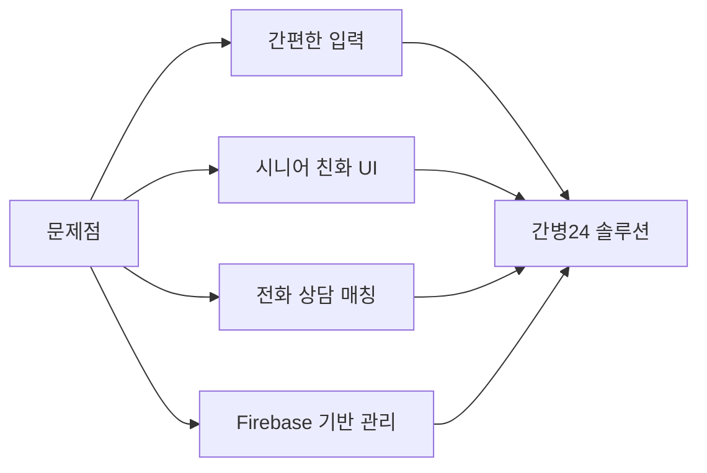
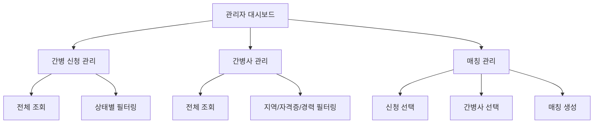
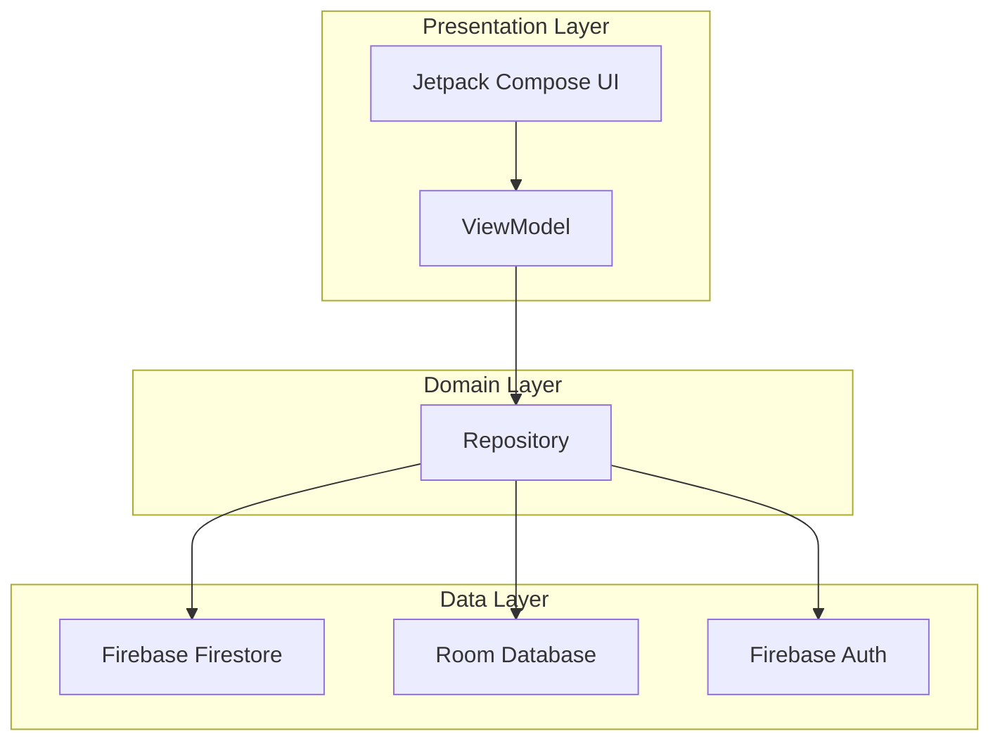
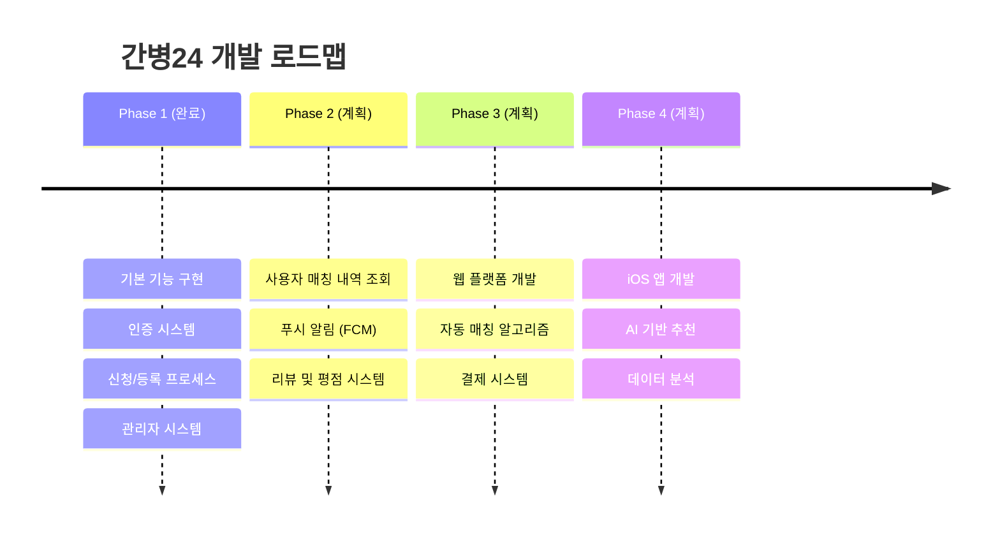

# 간병24 프로젝트 발표 PPT 제작 가이드 📊

## 📋 개요

이 문서는 **간병24** 프로젝트 발표를 위한 PPT 제작 가이드입니다. 프로젝트의 핵심 내용을 효과적으로 전달할 수 있도록 구성했습니다.

---

## 🎯 발표 목표

- 프로젝트의 **문제 해결 능력** 강조
- **기술적 구현**과 **사용자 중심 디자인** 부각
- 실제 동작하는 **데모**를 통한 설득력 확보
- 향후 **확장 가능성** 제시

---

## 📑 PPT 구성 (권장 슬라이드 수: 15-20장)

### 1️⃣ 표지 (1장)

**내용:**
- 프로젝트명: **간병24**
- 부제: "믿을 수 있는 간병 매칭 서비스"
- 발표자 이름 및 소속
- 발표 날짜

**디자인 팁:**
- 앱 로고나 대표 이미지 사용
- 파란색 계열의 브랜드 컬러 활용 (#2196F3)
- 깔끔하고 전문적인 느낌

---

### 2️⃣ 목차 (1장)

**내용:**
1. 프로젝트 소개
2. 문제 정의 및 해결 방안
3. 주요 기능
4. 기술 스택 및 아키텍처
5. 데모
6. 성과 및 향후 계획

---

### 3️⃣ 프로젝트 소개 (1-2장)

**슬라이드 1: 프로젝트 개요**
- **무엇을**: 간병인 매칭 플랫폼 Android 앱
- **왜**: 복잡한 절차 없이 간편하게 간병 서비스 이용
- **누구를 위해**: 40-70대 보호자 및 40-60대 간병사

**슬라이드 2: 핵심 가치**
- ✅ 간편한 사용 (최소한의 입력)
- ✅ 시니어 친화적 UI (큰 폰트, 명확한 버튼)
- ✅ 빠른 매칭 (전화 상담 연결)
- ✅ 안전한 데이터 관리 (Firebase)

**시각 자료:**
- 앱 아이콘 또는 메인 화면 스크린샷
- 타겟 사용자 페르소나 이미지

---

### 4️⃣ 문제 정의 및 해결 방안 (2장)

**슬라이드 1: 현재 문제점**

| 문제점 | 설명 |
|--------|------|
| 복잡한 절차 | 기존 서비스는 회원가입 및 인증 절차가 복잡 |
| 낮은 접근성 | 시니어 사용자가 사용하기 어려운 UI |
| 느린 매칭 | 간병사를 찾기까지 시간이 오래 걸림 |
| 신뢰성 부족 | 간병사 정보 확인이 어려움 |

**슬라이드 2: 우리의 해결 방안**



**시각 자료:**
- Before/After 비교 이미지
- 플로우차트 또는 다이어그램

---

### 5️⃣ 주요 기능 (3-4장)

**슬라이드 1: 사용자 역할 시스템**

| 역할 | 주요 기능 |
|------|----------|
| 👥 보호자 | 간병 신청, 내역 조회 |
| 👨‍⚕️ 간병사 | 프로필 등록, 자격증 관리 |
| 👨‍💼 관리자 | 신청 관리, 간병사 관리, 매칭 관리 |

**슬라이드 2: 간병 신청 프로세스 (보호자)**

1. **환자 정보 입력**
   - 환자명, 나이, 성별
   - 병원 및 병실 정보
   
2. **간병 조건 설정**
   - 시작일 및 기간
   - 특이사항 입력
   
3. **신청 완료**
   - 자동 일련번호 생성 (예: `100-0000-0001`)
   - 관리자 전화 상담 대기

**슬라이드 3: 간병사 등록 프로세스**

1. **프로필 정보**
   - 사진 업로드
   - 이름, 성별, 연락처
   
2. **경력 및 자격**
   - 경력 선택 (드롭다운)
   - 자격증 다중 선택 (칩)
   - 가능 지역 선택
   
3. **등록 완료**
   - 자동 일련번호 생성 (예: `200-0000-0001`)
   - 관리자 승인 대기

**슬라이드 4: 관리자 시스템**



**시각 자료:**
- 각 화면의 스크린샷 (3-4개)
- 사용자 플로우 다이어그램

---

### 6️⃣ 기술 스택 및 아키텍처 (2-3장)

**슬라이드 1: 기술 스택**

| 분류 | 기술 |
|------|------|
| **언어** | Kotlin 100% |
| **UI** | Jetpack Compose, Material Design 3 |
| **아키텍처** | MVVM (ViewModel + StateFlow) |
| **DI** | Koin |
| **비동기** | Kotlin Coroutines |
| **백엔드** | Firebase (Auth, Firestore) |
| **로컬 DB** | Room Database |
| **이미지** | Coil |

**슬라이드 2: 아키텍처 다이어그램**



**슬라이드 3: 데이터베이스 구조**

**Firestore Collections:**

| 컬렉션 | 설명 | SerialNumber 형식 |
|--------|------|-------------------|
| `users` | 사용자 정보 (role 포함) | - |
| `care_requests` | 간병 신청 정보 | `100-0000-0001` |
| `caregivers` | 간병사 정보 | `200-0000-0001` |
| `matches` | 매칭 정보 | `300-0000-0001` |
| `counters` | SerialNumber 카운터 | - |

**특징:**
- Transaction 기반 일련번호 생성 (중복 방지)
- Soft Delete 구현 (데이터 보존)
- 실시간 동기화

**시각 자료:**
- 아키텍처 다이어그램
- 기술 로고 모음
- 데이터베이스 스키마

---

### 7️⃣ 핵심 기술 구현 (2장)

**슬라이드 1: SerialNumber 시스템**

**문제:**
- Firebase 자동 생성 ID는 사람이 읽기 어려움
- 고객 지원 시 식별이 어려움

**해결:**
```kotlin
// SerialNumber 형식: XXX-XXXX-XXXX
// 간병 신청: 100-0000-0001 (10000000001)
// 간병사:   200-0000-0001 (20000000001)
// 매칭:     300-0000-0001 (30000000001)

fun formatSerialNumber(number: Long): String {
    val str = number.toString()
    return "${str.substring(0, 3)}-${str.substring(3, 7)}-${str.substring(7)}"
}
```

**장점:**
- 사람이 읽기 쉬움
- 타입 구분 가능 (첫 자리: 1=신청, 2=간병사, 3=매칭)
- 전화 상담 시 편리

**슬라이드 2: MVVM 아키텍처 적용**

**장점:**
- UI와 비즈니스 로직 분리
- 테스트 용이성 향상
- 코드 재사용성 증가

**예시:**
```kotlin
// ViewModel
class CareRequestViewModel(
    private val repository: CareRequestRepository
) : ViewModel() {
    private val _uiState = MutableStateFlow<UiState>(UiState.Idle)
    val uiState: StateFlow<UiState> = _uiState.asStateFlow()
    
    fun submitRequest(request: CareRequest) {
        viewModelScope.launch {
            _uiState.value = UiState.Loading
            repository.createRequest(request)
                .onSuccess { _uiState.value = UiState.Success }
                .onFailure { _uiState.value = UiState.Error(it.message) }
        }
    }
}
```

---

### 8️⃣ UI/UX 디자인 (2장)

**슬라이드 1: 시니어 친화적 디자인**

**디자인 원칙:**
- 📱 **큰 터치 영역**: 최소 48dp x 48dp
- 🔤 **큰 폰트**: 본문 16sp 이상
- 🎨 **높은 대비**: WCAG AA 기준 (4.5:1)
- 🔘 **명확한 버튼**: 높이 56dp, 둥근 모서리
- 📝 **간단한 입력**: 최소한의 필수 정보만

**슬라이드 2: 화면 예시**

**Before (기존 서비스):**
- 작은 글씨
- 복잡한 메뉴
- 많은 입력 필드

**After (간병24):**
- 큰 글씨 (20sp 버튼)
- 단순한 네비게이션
- 단계별 입력 (3단계)

**시각 자료:**
- 실제 앱 스크린샷 4-6개
- Before/After 비교
- 색상 팔레트 (#2196F3, #4CAF50)

---

### 9️⃣ 데모 (1장)

**슬라이드 내용:**

> 🎬 **실제 앱 데모**
> 
> 다음 기능을 시연합니다:
> 1. 로그인 및 역할 선택
> 2. 간병 신청 프로세스 (보호자)
> 3. 간병사 등록 프로세스
> 4. 관리자 매칭 시스템

**준비 사항:**
- ✅ 실제 디바이스 또는 에뮬레이터 준비
- ✅ 테스트 계정 준비 (보호자, 간병사, 관리자)
- ✅ 화면 녹화 영상 백업 (데모 실패 대비)
- ✅ Firebase 콘솔 준비 (실시간 데이터 확인)

**데모 시나리오:**
1. **보호자 계정 로그인** → 간병 신청 → 일련번호 확인
2. **관리자 계정 전환** → 신청 조회 → 간병사 매칭
3. **Firebase 콘솔** → 실시간 데이터 확인

---

### 🔟 성과 및 통계 (1-2장)

**슬라이드 1: 프로젝트 성과**

| 항목 | 수치/내용 |
|------|----------|
| **개발 기간** | 8주 (2개월) |
| **코드 라인** | ~5,000 lines (Kotlin) |
| **화면 수** | 15+ screens |
| **주요 기능** | 인증, 신청, 등록, 관리자 시스템 |
| **데이터 모델** | 4개 컬렉션 (users, care_requests, caregivers, matches) |

**슬라이드 2: 기술적 성취**

✅ **완료된 기능:**
- Firebase Authentication 연동
- MVVM 아키텍처 구현
- Koin DI 적용
- SerialNumber 시스템 구축
- 관리자 시스템 (3단계 매칭)
- Room Database 통합
- Soft Delete 구현

📊 **코드 품질:**
- 100% Kotlin
- MVVM 패턴 준수
- Repository 패턴 적용
- Coroutines 비동기 처리

---

### 1️⃣1️⃣ 향후 계획 (1-2장)

**슬라이드 1: 로드맵**



**슬라이드 2: 확장 가능성**

**단기 목표 (3개월):**
- 푸시 알림 구현
- 사용자 매칭 내역 조회
- 리뷰 시스템

**중기 목표 (6개월):**
- 웹 플랫폼 개발 (React + Vite)
- 자동 매칭 알고리즘
- 결제 시스템 통합

**장기 목표 (1년):**
- iOS 앱 출시
- AI 기반 간병사 추천
- 간병 일지 작성 기능

---

### 1️⃣2️⃣ 배운 점 및 어려웠던 점 (1-2장)

**슬라이드 1: 배운 점**

💡 **기술적 학습:**
- Jetpack Compose의 선언형 UI 패턴
- Firebase Firestore의 실시간 동기화
- MVVM 아키텍처의 실전 적용
- Koin을 통한 의존성 주입
- Transaction 기반 데이터 일관성 보장

💡 **프로젝트 관리:**
- 사용자 중심 설계의 중요성
- 단계적 개발 및 테스트
- 문서화의 중요성

**슬라이드 2: 어려웠던 점 및 해결**

| 문제 | 해결 방법 |
|------|----------|
| **SerialNumber 중복 생성** | Firestore Transaction 사용 |
| **복잡한 상태 관리** | StateFlow + sealed class 패턴 |
| **시니어 친화 UI 설계** | 접근성 가이드라인 준수, 큰 폰트/버튼 |
| **Firebase 비동기 처리** | Kotlin Coroutines + Flow |
| **다중 필터링 구현** | 복합 조건 쿼리 최적화 |

---

### 1️⃣3️⃣ 결론 (1장)

**핵심 메시지:**

> 🎯 **간병24는 시니어 사용자를 위한 간편하고 신뢰할 수 있는 간병 매칭 플랫폼입니다.**

**프로젝트 요약:**
- ✅ 사용자 중심의 간편한 UI/UX
- ✅ 안정적인 Firebase 기반 백엔드
- ✅ 확장 가능한 MVVM 아키텍처
- ✅ 효율적인 관리자 시스템

**기대 효과:**
- 간병 서비스 접근성 향상
- 매칭 시간 단축
- 사용자 만족도 증가
- 간병 시장 디지털 전환 기여

---

### 1️⃣4️⃣ Q&A (1장)

**슬라이드 내용:**

> 💬 **질문 있으신가요?**
> 
> 감사합니다!

**연락처:**
- GitHub: [프로젝트 링크]
- Email: your.email@example.com

**예상 질문 준비:**
1. **Q: 자동 매칭은 언제 구현하나요?**
   - A: Phase 2에서 구현 예정이며, 위치 기반 알고리즘을 우선 적용할 계획입니다.

2. **Q: 보안은 어떻게 처리하나요?**
   - A: Firebase Security Rules로 접근 제어, HTTPS 통신, 개인정보는 최소 수집 원칙을 따릅니다.

3. **Q: iOS 앱 개발 계획은?**
   - A: Phase 4에서 SwiftUI로 개발 예정이며, 동일한 Firebase 백엔드를 사용합니다.

4. **Q: 결제 시스템은?**
   - A: Phase 3에서 토스페이먼츠 또는 아임포트 연동을 고려 중입니다.

---

## 🎨 PPT 디자인 가이드

### 색상 팔레트

```
Primary Color:   #2196F3 (파란색)
Secondary Color: #4CAF50 (초록색)
Error Color:     #F44336 (빨간색)
Background:      #FFFFFF (흰색)
Text:            #212121 (검정)
```

### 폰트 추천

- **제목**: Noto Sans KR Bold, 32-40pt
- **본문**: Noto Sans KR Regular, 18-24pt
- **코드**: Consolas 또는 Fira Code, 14-16pt

### 레이아웃 팁

1. **여백 충분히**: 슬라이드가 답답하지 않게
2. **한 슬라이드 한 메시지**: 핵심만 전달
3. **시각 자료 활용**: 텍스트보다 이미지/다이어그램
4. **일관성 유지**: 모든 슬라이드 동일한 템플릿

---

## 📱 데모 준비 체크리스트

### 사전 준비

- [ ] 실제 디바이스 또는 에뮬레이터 준비
- [ ] 테스트 계정 생성
  - [ ] 보호자 계정 (guardian@test.com)
  - [ ] 간병사 계정 (caregiver@test.com)
  - [ ] 관리자 계정 (admin@test.com)
- [ ] Firebase 프로젝트 확인
- [ ] 인터넷 연결 확인
- [ ] 화면 녹화 영상 백업

### 데모 시나리오

**시나리오 1: 보호자 간병 신청 (3분)**
1. 앱 실행 → 로그인
2. "간병이 필요해요" 선택
3. 환자 정보 입력 (3단계)
4. 신청 완료 → 일련번호 확인

**시나리오 2: 관리자 매칭 (2분)**
1. 관리자 로그인
2. 간병 신청 목록 조회
3. 신청 선택 → 간병사 매칭
4. 매칭 완료 확인

**시나리오 3: Firebase 실시간 확인 (1분)**
1. Firebase 콘솔 열기
2. Firestore 데이터 확인
3. 실시간 동기화 시연

---

## 💡 발표 팁

### 발표 전

1. **리허설**: 최소 3번 이상 연습
2. **시간 체크**: 10-15분 내로 조절
3. **백업 준비**: 데모 영상, PDF 버전
4. **질문 예상**: 5-10개 질문 답변 준비

### 발표 중

1. **자신감**: 당당하게 발표
2. **청중 응시**: 눈 맞춤 유지
3. **속도 조절**: 너무 빠르지 않게
4. **강조**: 핵심 기능 반복 설명

### 발표 후

1. **질문 경청**: 끝까지 듣기
2. **솔직하게**: 모르면 "확인 후 답변" 가능
3. **감사 인사**: 마무리 인사

---

## 📚 참고 자료

### PPT 템플릿 추천

- [Canva](https://www.canva.com/) - 무료 템플릿 다양
- [SlidesGo](https://slidesgo.com/) - 기술 발표용 템플릿
- [Google Slides](https://slides.google.com/) - 협업 용이

### 다이어그램 도구

- [Mermaid](https://mermaid.js.org/) - 코드로 다이어그램 생성
- [Excalidraw](https://excalidraw.com/) - 손그림 스타일
- [Draw.io](https://app.diagrams.net/) - 전문적인 다이어그램

### 스크린샷 도구

- **Android Studio**: Device Manager → Screenshot
- **ADB**: `adb shell screencap -p /sdcard/screenshot.png`
- **화면 녹화**: Android 내장 화면 녹화 기능

---

## ✅ 최종 체크리스트

### PPT 완성도

- [ ] 모든 슬라이드 작성 완료 (15-20장)
- [ ] 오타 및 문법 확인
- [ ] 이미지 해상도 확인
- [ ] 애니메이션 적절히 사용
- [ ] 폰트 일관성 확인

### 데모 준비

- [ ] 테스트 계정 동작 확인
- [ ] 데모 시나리오 리허설
- [ ] 백업 영상 준비
- [ ] Firebase 콘솔 준비

### 발표 준비

- [ ] 발표 대본 작성 (선택)
- [ ] 시간 측정 (10-15분)
- [ ] 질문 답변 준비
- [ ] 자신감 있는 태도

---

## 🎉 마무리

이 가이드를 따라 PPT를 제작하면 **간병24** 프로젝트의 가치를 효과적으로 전달할 수 있습니다!

**핵심 포인트:**
1. 문제 해결 능력 강조
2. 기술적 구현 상세히 설명
3. 실제 동작하는 데모 시연
4. 향후 확장 가능성 제시

**화이팅! 🚀**
