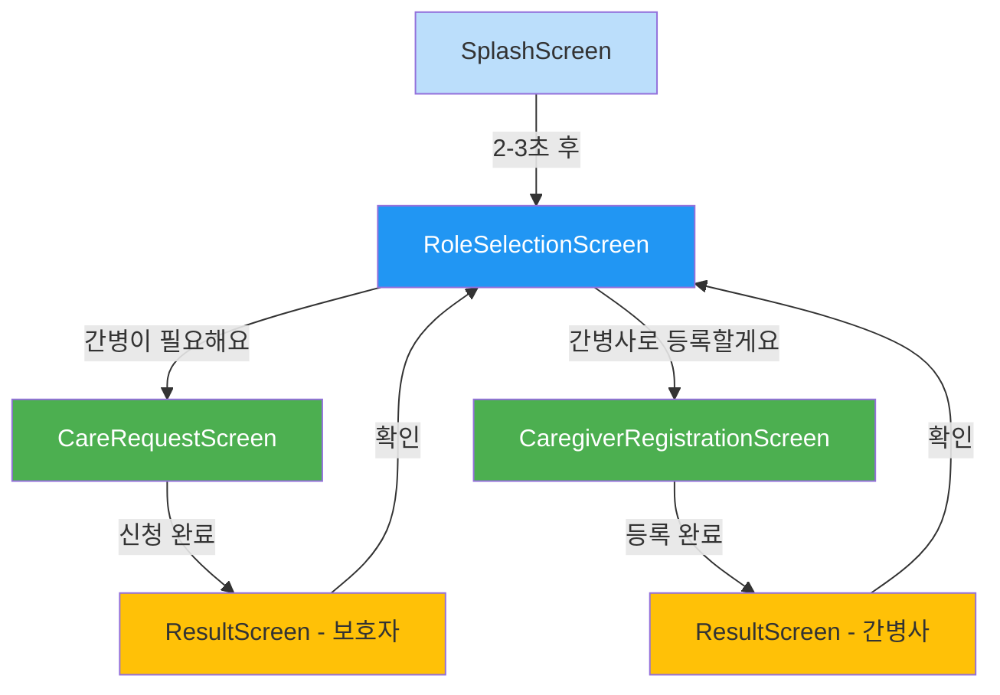
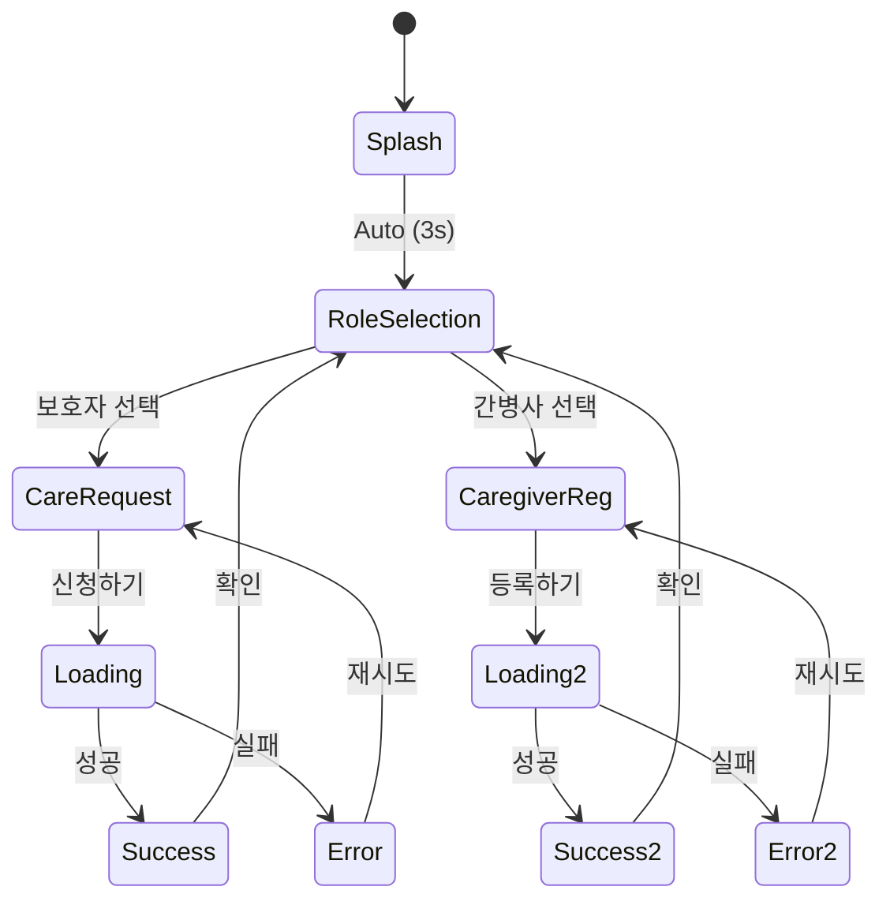

# 간병24 - 화면 설계서 (Screen Specifications)

## 📋 문서 정보

- **프로젝트명**: 간병24
- **작성일**: 2026-01-14
- **버전**: 1.0
- **작성자**: Development Team

---

## 🗺 화면 플로우 다이어그램

### 전체 화면 플로우



### 상태 전환 다이어그램



---

## 📱 화면별 상세 설계

## 1. SplashScreen (인트로 화면)

### 목적
- 앱 로딩 및 초기화
- 브랜드 인지도 향상

### UI 구성

```
┌─────────────────────────┐
│                         │
│                         │
│         [로고]          │
│       간병24            │
│                         │
│    [로딩 인디케이터]     │
│                         │
│                         │
│      v1.0.0             │
└─────────────────────────┘
```

### 구현 명세

```kotlin
@Composable
fun SplashScreen(
    onNavigateToRoleSelection: () -> Unit
) {
    LaunchedEffect(Unit) {
        delay(2000) // 2초 대기
        onNavigateToRoleSelection()
    }
    
    Box(
        modifier = Modifier
            .fillMaxSize()
            .background(MaterialTheme.colorScheme.primary),
        contentAlignment = Alignment.Center
    ) {
        Column(
            horizontalAlignment = Alignment.CenterHorizontally,
            verticalArrangement = Arrangement.spacedBy(24.dp)
        ) {
            // 로고 이미지
            Image(
                painter = painterResource(R.drawable.ic_logo),
                contentDescription = "간병24 로고",
                modifier = Modifier.size(120.dp)
            )
            
            // 앱 이름
            Text(
                text = "간병24",
                style = MaterialTheme.typography.headlineLarge,
                color = Color.White
            )
            
            // 로딩 인디케이터
            CircularProgressIndicator(
                color = Color.White,
                modifier = Modifier.size(32.dp)
            )
        }
        
        // 버전 정보
        Text(
            text = "v1.0.0",
            style = MaterialTheme.typography.bodySmall,
            color = Color.White.copy(alpha = 0.7f),
            modifier = Modifier
                .align(Alignment.BottomCenter)
                .padding(bottom = 32.dp)
        )
    }
}
```

### 상태 관리
- 상태 없음 (단순 타이머)

---

## 2. RoleSelectionScreen (역할 선택 화면)

### 목적
- 사용자 유형 구분 (보호자 vs 간병사)

### UI 구성

```
┌─────────────────────────┐
│   간병24에 오신 것을     │
│     환영합니다          │
│                         │
│  원하시는 서비스를      │
│   선택해주세요          │
│                         │
│  ┌───────────────────┐  │
│  │   💙 간병이       │  │
│  │    필요해요       │  │
│  └───────────────────┘  │
│                         │
│  ┌───────────────────┐  │
│  │   👤 간병사로     │  │
│  │   등록할게요      │  │
│  └───────────────────┘  │
│                         │
└─────────────────────────┘
```

### 구현 명세

```kotlin
@Composable
fun RoleSelectionScreen(
    onGuardianSelected: () -> Unit,
    onCaregiverSelected: () -> Unit
) {
    Column(
        modifier = Modifier
            .fillMaxSize()
            .padding(24.dp),
        horizontalAlignment = Alignment.CenterHorizontally,
        verticalArrangement = Arrangement.Center
    ) {
        // 제목
        Text(
            text = "간병24에 오신 것을\n환영합니다",
            style = MaterialTheme.typography.headlineLarge,
            textAlign = TextAlign.Center,
            modifier = Modifier.padding(bottom = 16.dp)
        )
        
        // 설명
        Text(
            text = "원하시는 서비스를 선택해주세요",
            style = MaterialTheme.typography.bodyLarge,
            color = MaterialTheme.colorScheme.onSurface.copy(alpha = 0.7f),
            textAlign = TextAlign.Center,
            modifier = Modifier.padding(bottom = 48.dp)
        )
        
        // 보호자 버튼
        RoleButton(
            icon = Icons.Default.Favorite,
            text = "간병이 필요해요",
            onClick = onGuardianSelected,
            modifier = Modifier.padding(bottom = 16.dp)
        )
        
        // 간병사 버튼
        RoleButton(
            icon = Icons.Default.Person,
            text = "간병사로 등록할게요",
            onClick = onCaregiverSelected
        )
    }
}

@Composable
private fun RoleButton(
    icon: ImageVector,
    text: String,
    onClick: () -> Unit,
    modifier: Modifier = Modifier
) {
    Button(
        onClick = onClick,
        modifier = modifier
            .fillMaxWidth()
            .height(80.dp),
        shape = RoundedCornerShape(12.dp),
        colors = ButtonDefaults.buttonColors(
            containerColor = MaterialTheme.colorScheme.primary
        )
    ) {
        Row(
            verticalAlignment = Alignment.CenterVertically,
            horizontalArrangement = Arrangement.Center
        ) {
            Icon(
                imageVector = icon,
                contentDescription = null,
                modifier = Modifier.size(32.dp)
            )
            Spacer(modifier = Modifier.width(16.dp))
            Text(
                text = text,
                style = MaterialTheme.typography.headlineMedium
            )
        }
    }
}
```

### 상태 관리
- 상태 없음 (단순 네비게이션)

---

## 3. CareRequestScreen (간병 신청 화면)

### 목적
- 보호자가 간병 서비스 신청

### UI 구성

```
┌─────────────────────────┐
│   ← 간병 신청           │
├─────────────────────────┤
│                         │
│  환자명 *               │
│  [홍길동_______]        │
│                         │
│  보호자명 *             │
│  [김철수_______]        │
│                         │
│  환자 상태 *            │
│  [거동 가능 ▼]         │
│                         │
│  간병 기간 *            │
│  [2024-01-15 ~ 01-30]  │
│                         │
│  위치 *                 │
│  [서울시 강남구___]     │
│                         │
│  환자 연락처 (선택)     │
│  [010-1234-5678]       │
│                         │
│  보호자 연락처 *        │
│  [010-9876-5432]       │
│                         │
├─────────────────────────┤
│   [    신청하기    ]    │
└─────────────────────────┘
```

### 구현 명세

```kotlin
data class CareRequestState(
    val isLoading: Boolean = false,
    val isSuccess: Boolean = false,
    val errorMessage: String? = null,
    
    val patientName: String = "",
    val guardianName: String = "",
    val patientCondition: String = "",
    val careStartDate: Long? = null,
    val careEndDate: Long? = null,
    val location: String = "",
    val patientPhoneNumber: String = "",
    val guardianPhoneNumber: String = "",
    
    val patientNameError: String? = null,
    val guardianNameError: String? = null,
    val patientConditionError: String? = null,
    val locationError: String? = null,
    val guardianPhoneNumberError: String? = null
)

@Composable
fun CareRequestScreen(
    viewModel: CareRequestViewModel = koinViewModel(),
    onSuccess: () -> Unit
) {
    val state by viewModel.state.collectAsState()
    
    LaunchedEffect(state.isSuccess) {
        if (state.isSuccess) {
            onSuccess()
        }
    }
    
    Scaffold(
        topBar = {
            TopAppBar(
                title = { Text("간병 신청") },
                navigationIcon = {
                    IconButton(onClick = { /* 뒤로가기 */ }) {
                        Icon(Icons.Default.ArrowBack, "뒤로가기")
                    }
                }
            )
        }
    ) { padding ->
        Column(
            modifier = Modifier
                .fillMaxSize()
                .padding(padding)
                .verticalScroll(rememberScrollState())
                .padding(24.dp)
        ) {
            // 환자명
            GanbyeongTextField(
                value = state.patientName,
                onValueChange = viewModel::onPatientNameChange,
                label = "환자명 *",
                placeholder = "예: 홍길동",
                isError = state.patientNameError != null,
                errorMessage = state.patientNameError,
                modifier = Modifier.padding(bottom = 16.dp)
            )
            
            // 보호자명
            GanbyeongTextField(
                value = state.guardianName,
                onValueChange = viewModel::onGuardianNameChange,
                label = "보호자명 *",
                placeholder = "예: 김철수",
                isError = state.guardianNameError != null,
                errorMessage = state.guardianNameError,
                modifier = Modifier.padding(bottom = 16.dp)
            )
            
            // 환자 상태 (드롭다운)
            PatientConditionDropdown(
                selectedCondition = state.patientCondition,
                onConditionSelected = viewModel::onPatientConditionChange,
                isError = state.patientConditionError != null,
                errorMessage = state.patientConditionError,
                modifier = Modifier.padding(bottom = 16.dp)
            )
            
            // 간병 기간 (날짜 선택)
            CarePeriodPicker(
                startDate = state.careStartDate,
                endDate = state.careEndDate,
                onStartDateSelected = viewModel::onCareStartDateChange,
                onEndDateSelected = viewModel::onCareEndDateChange,
                modifier = Modifier.padding(bottom = 16.dp)
            )
            
            // 위치
            GanbyeongTextField(
                value = state.location,
                onValueChange = viewModel::onLocationChange,
                label = "위치 *",
                placeholder = "예: 서울시 강남구",
                isError = state.locationError != null,
                errorMessage = state.locationError,
                modifier = Modifier.padding(bottom = 16.dp)
            )
            
            // 환자 연락처 (선택)
            GanbyeongTextField(
                value = state.patientPhoneNumber,
                onValueChange = viewModel::onPatientPhoneNumberChange,
                label = "환자 연락처 (선택)",
                placeholder = "010-1234-5678",
                keyboardOptions = KeyboardOptions(keyboardType = KeyboardType.Phone),
                modifier = Modifier.padding(bottom = 16.dp)
            )
            
            // 보호자 연락처 (필수)
            GanbyeongTextField(
                value = state.guardianPhoneNumber,
                onValueChange = viewModel::onGuardianPhoneNumberChange,
                label = "보호자 연락처 *",
                placeholder = "010-9876-5432",
                isError = state.guardianPhoneNumberError != null,
                errorMessage = state.guardianPhoneNumberError,
                keyboardOptions = KeyboardOptions(keyboardType = KeyboardType.Phone),
                modifier = Modifier.padding(bottom = 32.dp)
            )
            
            // 신청 버튼
            GanbyeongButton(
                text = "신청하기",
                onClick = viewModel::submitCareRequest,
                isLoading = state.isLoading
            )
        }
    }
    
    // 에러 다이얼로그
    if (state.errorMessage != null) {
        AlertDialog(
            onDismissRequest = viewModel::clearError,
            title = { Text("오류") },
            text = { Text(state.errorMessage!!) },
            confirmButton = {
                TextButton(onClick = viewModel::clearError) {
                    Text("확인")
                }
            }
        )
    }
}
```

### ViewModel

```kotlin
class CareRequestViewModel(
    private val repository: CareRequestRepository
) : ViewModel() {
    
    private val _state = MutableStateFlow(CareRequestState())
    val state: StateFlow<CareRequestState> = _state.asStateFlow()
    
    fun onPatientNameChange(name: String) {
        _state.update { it.copy(
            patientName = name,
            patientNameError = null
        )}
    }
    
    fun onGuardianNameChange(name: String) {
        _state.update { it.copy(
            guardianName = name,
            guardianNameError = null
        )}
    }
    
    // ... 기타 입력 핸들러
    
    fun submitCareRequest() {
        if (!validateForm()) return
        
        viewModelScope.launch {
            _state.update { it.copy(isLoading = true) }
            
            val request = CareRequest(
                patientName = _state.value.patientName,
                guardianName = _state.value.guardianName,
                patientCondition = _state.value.patientCondition,
                careStartDate = Timestamp(_state.value.careStartDate!!),
                careEndDate = Timestamp(_state.value.careEndDate!!),
                location = _state.value.location,
                patientPhoneNumber = _state.value.patientPhoneNumber.ifBlank { null },
                guardianPhoneNumber = _state.value.guardianPhoneNumber,
                status = "pending",
                createdAt = Timestamp.now()
            )
            
            repository.saveCareRequest(request)
                .onSuccess {
                    _state.update { it.copy(
                        isLoading = false,
                        isSuccess = true
                    )}
                }
                .onFailure { error ->
                    _state.update { it.copy(
                        isLoading = false,
                        errorMessage = error.message ?: "알 수 없는 오류가 발생했습니다"
                    )}
                }
        }
    }
    
    private fun validateForm(): Boolean {
        val errors = mutableMapOf<String, String>()
        
        // 환자명 검증
        if (_state.value.patientName.length < 2) {
            errors["patientName"] = "환자명은 2자 이상 입력해주세요"
        }
        
        // 보호자명 검증
        if (_state.value.guardianName.length < 2) {
            errors["guardianName"] = "보호자명은 2자 이상 입력해주세요"
        }
        
        // 환자 상태 검증
        if (_state.value.patientCondition.isBlank()) {
            errors["patientCondition"] = "환자 상태를 선택해주세요"
        }
        
        // 위치 검증
        if (_state.value.location.isBlank()) {
            errors["location"] = "위치를 입력해주세요"
        }
        
        // 보호자 연락처 검증
        val phoneRegex = "^010\\d{8}$".toRegex()
        val cleanPhone = _state.value.guardianPhoneNumber.replace("-", "")
        if (!phoneRegex.matches(cleanPhone)) {
            errors["guardianPhoneNumber"] = "올바른 전화번호 형식이 아닙니다 (010-XXXX-XXXX)"
        }
        
        // 에러 업데이트
        _state.update { it.copy(
            patientNameError = errors["patientName"],
            guardianNameError = errors["guardianName"],
            patientConditionError = errors["patientCondition"],
            locationError = errors["location"],
            guardianPhoneNumberError = errors["guardianPhoneNumber"]
        )}
        
        return errors.isEmpty()
    }
    
    fun clearError() {
        _state.update { it.copy(errorMessage = null) }
    }
}
```

---

## 4. CaregiverRegistrationScreen (간병사 등록 화면)

### 목적
- 간병사 정보 등록

### UI 구성

```
┌─────────────────────────┐
│   ← 간병사 등록         │
├─────────────────────────┤
│                         │
│  이름 *                 │
│  [김영희_______]        │
│                         │
│  경력 *                 │
│  [5년 이상 ▼]          │
│                         │
│  자격증 *               │
│  ☑ 요양보호사           │
│  ☐ 간호조무사           │
│  ☐ 간호사               │
│                         │
│  가능 지역 *            │
│  ☑ 서울                 │
│  ☑ 경기                 │
│  ☐ 인천                 │
│                         │
│  연락처 *               │
│  [010-1111-2222]       │
│                         │
├─────────────────────────┤
│   [    등록하기    ]    │
└─────────────────────────┘
```

### 구현 명세

```kotlin
data class CaregiverState(
    val isLoading: Boolean = false,
    val isSuccess: Boolean = false,
    val errorMessage: String? = null,
    
    val name: String = "",
    val experience: String = "",
    val certificates: List<String> = emptyList(),
    val availableRegions: List<String> = emptyList(),
    val phoneNumber: String = "",
    
    val nameError: String? = null,
    val experienceError: String? = null,
    val certificatesError: String? = null,
    val availableRegionsError: String? = null,
    val phoneNumberError: String? = null
)

@Composable
fun CaregiverRegistrationScreen(
    viewModel: CaregiverViewModel = koinViewModel(),
    onSuccess: () -> Unit
) {
    val state by viewModel.state.collectAsState()
    
    LaunchedEffect(state.isSuccess) {
        if (state.isSuccess) {
            onSuccess()
        }
    }
    
    Scaffold(
        topBar = {
            TopAppBar(
                title = { Text("간병사 등록") },
                navigationIcon = {
                    IconButton(onClick = { /* 뒤로가기 */ }) {
                        Icon(Icons.Default.ArrowBack, "뒤로가기")
                    }
                }
            )
        }
    ) { padding ->
        Column(
            modifier = Modifier
                .fillMaxSize()
                .padding(padding)
                .verticalScroll(rememberScrollState())
                .padding(24.dp)
        ) {
            // 이름
            GanbyeongTextField(
                value = state.name,
                onValueChange = viewModel::onNameChange,
                label = "이름 *",
                placeholder = "예: 김영희",
                isError = state.nameError != null,
                errorMessage = state.nameError,
                modifier = Modifier.padding(bottom = 16.dp)
            )
            
            // 경력
            ExperienceDropdown(
                selectedExperience = state.experience,
                onExperienceSelected = viewModel::onExperienceChange,
                isError = state.experienceError != null,
                errorMessage = state.experienceError,
                modifier = Modifier.padding(bottom = 16.dp)
            )
            
            // 자격증
            CertificatesCheckboxGroup(
                selectedCertificates = state.certificates,
                onCertificatesChange = viewModel::onCertificatesChange,
                isError = state.certificatesError != null,
                errorMessage = state.certificatesError,
                modifier = Modifier.padding(bottom = 16.dp)
            )
            
            // 가능 지역
            RegionsCheckboxGroup(
                selectedRegions = state.availableRegions,
                onRegionsChange = viewModel::onAvailableRegionsChange,
                isError = state.availableRegionsError != null,
                errorMessage = state.availableRegionsError,
                modifier = Modifier.padding(bottom = 16.dp)
            )
            
            // 연락처
            GanbyeongTextField(
                value = state.phoneNumber,
                onValueChange = viewModel::onPhoneNumberChange,
                label = "연락처 *",
                placeholder = "010-1111-2222",
                isError = state.phoneNumberError != null,
                errorMessage = state.phoneNumberError,
                keyboardOptions = KeyboardOptions(keyboardType = KeyboardType.Phone),
                modifier = Modifier.padding(bottom = 32.dp)
            )
            
            // 등록 버튼
            GanbyeongButton(
                text = "등록하기",
                onClick = viewModel::registerCaregiver,
                isLoading = state.isLoading
            )
        }
    }
    
    // 에러 다이얼로그
    if (state.errorMessage != null) {
        AlertDialog(
            onDismissRequest = viewModel::clearError,
            title = { Text("오류") },
            text = { Text(state.errorMessage!!) },
            confirmButton = {
                TextButton(onClick = viewModel::clearError) {
                    Text("확인")
                }
            }
        )
    }
}
```

---

## 5. ResultScreen (완료 화면)

### 목적
- 신청/등록 완료 확인

### UI 구성

```
┌─────────────────────────┐
│                         │
│                         │
│         ✓               │
│      (큰 체크)          │
│                         │
│   간병 신청이           │
│   완료되었습니다        │
│                         │
│   곧 담당자가 전화로    │
│   연락드릴 예정입니다   │
│                         │
│   연락처: 1234-5678     │
│                         │
│                         │
│   [     확인     ]      │
│                         │
└─────────────────────────┘
```

### 구현 명세

```kotlin
@Composable
fun ResultScreen(
    userRole: String, // "guardian" or "caregiver"
    onConfirm: () -> Unit
) {
    val isGuardian = userRole == "guardian"
    
    Box(
        modifier = Modifier
            .fillMaxSize()
            .padding(24.dp),
        contentAlignment = Alignment.Center
    ) {
        Column(
            horizontalAlignment = Alignment.CenterHorizontally,
            verticalArrangement = Arrangement.spacedBy(24.dp)
        ) {
            // 성공 아이콘
            Icon(
                imageVector = Icons.Default.CheckCircle,
                contentDescription = "완료",
                tint = MaterialTheme.colorScheme.secondary,
                modifier = Modifier.size(80.dp)
            )
            
            // 메시지
            Text(
                text = if (isGuardian) {
                    "간병 신청이\n완료되었습니다"
                } else {
                    "간병사 등록이\n완료되었습니다"
                },
                style = MaterialTheme.typography.headlineLarge,
                textAlign = TextAlign.Center
            )
            
            // 안내 문구
            Column(
                horizontalAlignment = Alignment.CenterHorizontally,
                verticalArrangement = Arrangement.spacedBy(8.dp)
            ) {
                Text(
                    text = "곧 담당자가 전화로\n연락드릴 예정입니다",
                    style = MaterialTheme.typography.bodyLarge,
                    color = MaterialTheme.colorScheme.onSurface.copy(alpha = 0.7f),
                    textAlign = TextAlign.Center
                )
                
                Text(
                    text = "연락처: 1234-5678",
                    style = MaterialTheme.typography.bodyLarge,
                    color = MaterialTheme.colorScheme.primary,
                    fontWeight = FontWeight.Bold
                )
            }
            
            Spacer(modifier = Modifier.height(32.dp))
            
            // 확인 버튼
            GanbyeongButton(
                text = "확인",
                onClick = onConfirm,
                modifier = Modifier.fillMaxWidth()
            )
        }
    }
}
```

---

## 🎨 공통 컴포넌트 상세

### 1. PatientConditionDropdown

```kotlin
@Composable
fun PatientConditionDropdown(
    selectedCondition: String,
    onConditionSelected: (String) -> Unit,
    isError: Boolean = false,
    errorMessage: String? = null,
    modifier: Modifier = Modifier
) {
    val conditions = listOf("거동 가능", "거동 불가", "부분 도움 필요")
    var expanded by remember { mutableStateOf(false) }
    
    Column(modifier = modifier) {
        ExposedDropdownMenuBox(
            expanded = expanded,
            onExpandedChange = { expanded = it }
        ) {
            OutlinedTextField(
                value = selectedCondition,
                onValueChange = {},
                readOnly = true,
                label = { Text("환자 상태 *") },
                trailingIcon = {
                    ExposedDropdownMenuDefaults.TrailingIcon(expanded = expanded)
                },
                isError = isError,
                modifier = Modifier
                    .fillMaxWidth()
                    .menuAnchor()
            )
            
            ExposedDropdownMenu(
                expanded = expanded,
                onDismissRequest = { expanded = false }
            ) {
                conditions.forEach { condition ->
                    DropdownMenuItem(
                        text = { Text(condition) },
                        onClick = {
                            onConditionSelected(condition)
                            expanded = false
                        }
                    )
                }
            }
        }
        
        if (isError && errorMessage != null) {
            Text(
                text = errorMessage,
                color = MaterialTheme.colorScheme.error,
                style = MaterialTheme.typography.bodySmall,
                modifier = Modifier.padding(start = 16.dp, top = 4.dp)
            )
        }
    }
}
```

### 2. CarePeriodPicker

```kotlin
@Composable
fun CarePeriodPicker(
    startDate: Long?,
    endDate: Long?,
    onStartDateSelected: (Long) -> Unit,
    onEndDateSelected: (Long) -> Unit,
    modifier: Modifier = Modifier
) {
    Column(modifier = modifier) {
        Text(
            text = "간병 기간 *",
            style = MaterialTheme.typography.bodyLarge,
            modifier = Modifier.padding(bottom = 8.dp)
        )
        
        Row(
            modifier = Modifier.fillMaxWidth(),
            horizontalArrangement = Arrangement.spacedBy(8.dp)
        ) {
            // 시작일
            DatePickerButton(
                label = "시작일",
                selectedDate = startDate,
                onDateSelected = onStartDateSelected,
                modifier = Modifier.weight(1f)
            )
            
            Text(
                text = "~",
                modifier = Modifier.align(Alignment.CenterVertically)
            )
            
            // 종료일
            DatePickerButton(
                label = "종료일",
                selectedDate = endDate,
                onDateSelected = onEndDateSelected,
                modifier = Modifier.weight(1f)
            )
        }
    }
}
```

### 3. CertificatesCheckboxGroup

```kotlin
@Composable
fun CertificatesCheckboxGroup(
    selectedCertificates: List<String>,
    onCertificatesChange: (List<String>) -> Unit,
    isError: Boolean = false,
    errorMessage: String? = null,
    modifier: Modifier = Modifier
) {
    val certificates = listOf("요양보호사", "간호조무사", "간호사", "기타")
    
    Column(modifier = modifier) {
        Text(
            text = "자격증 *",
            style = MaterialTheme.typography.bodyLarge,
            modifier = Modifier.padding(bottom = 8.dp)
        )
        
        certificates.forEach { certificate ->
            Row(
                modifier = Modifier
                    .fillMaxWidth()
                    .clickable {
                        val newList = if (selectedCertificates.contains(certificate)) {
                            selectedCertificates - certificate
                        } else {
                            selectedCertificates + certificate
                        }
                        onCertificatesChange(newList)
                    }
                    .padding(vertical = 8.dp),
                verticalAlignment = Alignment.CenterVertically
            ) {
                Checkbox(
                    checked = selectedCertificates.contains(certificate),
                    onCheckedChange = null
                )
                Spacer(modifier = Modifier.width(8.dp))
                Text(
                    text = certificate,
                    style = MaterialTheme.typography.bodyLarge
                )
            }
        }
        
        if (isError && errorMessage != null) {
            Text(
                text = errorMessage,
                color = MaterialTheme.colorScheme.error,
                style = MaterialTheme.typography.bodySmall,
                modifier = Modifier.padding(start = 16.dp, top = 4.dp)
            )
        }
    }
}
```

---

## 📊 상태 관리 전략

### StateFlow 사용

모든 ViewModel은 `StateFlow`를 사용하여 UI 상태를 관리합니다:

```kotlin
private val _state = MutableStateFlow(InitialState())
val state: StateFlow<State> = _state.asStateFlow()
```

### 상태 업데이트

```kotlin
_state.update { currentState ->
    currentState.copy(
        field = newValue,
        error = null
    )
}
```

### Composable에서 수집

```kotlin
val state by viewModel.state.collectAsState()
```

---

## 🔄 화면 전환 애니메이션

### Navigation Compose 애니메이션

```kotlin
composable(
    route = Screen.CareRequest.route,
    enterTransition = {
        slideInHorizontally(
            initialOffsetX = { it },
            animationSpec = tween(300)
        )
    },
    exitTransition = {
        slideOutHorizontally(
            targetOffsetX = { -it },
            animationSpec = tween(300)
        )
    }
) {
    CareRequestScreen(onSuccess = { /* ... */ })
}
```

---

## 🔄 버전 관리

| 버전 | 날짜 | 작성자 | 변경 사항 |
|------|------|--------|-----------|
| 1.0 | 2026-01-14 | Development Team | 초기 화면 설계서 작성 |

---

**문서 작성일**: 2026년 1월 14일  
**최종 수정일**: 2026년 1월 14일  
**문서 상태**: 초안 (Draft)
