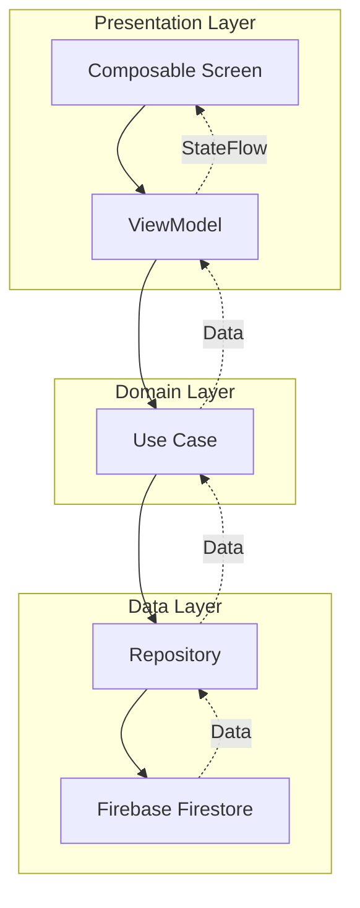
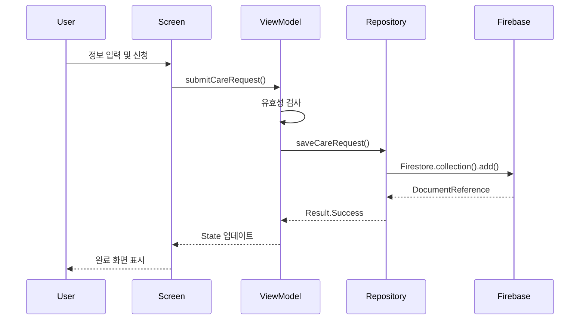

# 간병24 - 기술 설계서 (Technical Design Document)

## 📋 문서 정보

- **프로젝트명**: 간병24
- **작성일**: 2026-01-14
- **버전**: 1.0
- **작성자**: Development Team

---

## 🏗 프로젝트 구조

### 패키지 구조

```
com.ganbyeong24.app/
├── GanbyeongApplication.kt          # Application 클래스
│
├── di/                               # 의존성 주입
│   └── AppModule.kt                  # Koin 모듈 정의
│
├── data/                             # 데이터 레이어
│   ├── model/                        # 데이터 모델
│   │   ├── CareRequest.kt
│   │   └── Caregiver.kt
│   │
│   ├── repository/                   # Repository 인터페이스 및 구현
│   │   ├── CareRequestRepository.kt
│   │   └── CaregiverRepository.kt
│   │
│   └── remote/                       # Firebase 관련
│       └── FirebaseDataSource.kt
│
├── domain/                           # 도메인 레이어 (선택 사항)
│   └── usecase/                      # Use Cases
│       ├── SubmitCareRequestUseCase.kt
│       └── RegisterCaregiverUseCase.kt
│
├── presentation/                     # 프레젠테이션 레이어
│   ├── theme/                        # Compose 테마
│   │   ├── Color.kt
│   │   ├── Type.kt
│   │   └── Theme.kt
│   │
│   ├── components/                   # 재사용 가능한 UI 컴포넌트
│   │   ├── GanbyeongButton.kt
│   │   ├── GanbyeongTextField.kt
│   │   └── LoadingDialog.kt
│   │
│   ├── navigation/                   # Navigation
│   │   ├── NavGraph.kt
│   │   └── Screen.kt
│   │
│   └── screens/                      # 화면별 패키지
│       ├── splash/
│       │   └── SplashScreen.kt
│       │
│       ├── role/
│       │   └── RoleSelectionScreen.kt
│       │
│       ├── care_request/
│       │   ├── CareRequestScreen.kt
│       │   ├── CareRequestViewModel.kt
│       │   └── CareRequestState.kt
│       │
│       ├── caregiver/
│       │   ├── CaregiverRegistrationScreen.kt
│       │   ├── CaregiverViewModel.kt
│       │   └── CaregiverState.kt
│       │
│       └── result/
│           └── ResultScreen.kt
│
└── util/                             # 유틸리티
    ├── Constants.kt
    ├── ValidationUtils.kt
    └── FormatUtils.kt
```

---

## 🎯 아키텍처 개요

### MVVM 아키텍처



### 데이터 플로우

#### 간병 신청 플로우


---

## 🔧 기술 스택 상세

### 1. Jetpack Compose

**버전**: 최신 안정 버전 (BOM 사용)

```kotlin
// build.gradle.kts (Project)
dependencies {
    implementation(platform("androidx.compose:compose-bom:2024.01.00"))
    implementation("androidx.compose.ui:ui")
    implementation("androidx.compose.material3:material3")
    implementation("androidx.compose.ui:ui-tooling-preview")
    implementation("androidx.activity:activity-compose:1.8.2")
    implementation("androidx.lifecycle:lifecycle-viewmodel-compose:2.7.0")
}
```

### 2. Firebase

**사용 서비스**:
- Firestore (데이터베이스)
- Authentication (향후)
- Cloud Messaging (향후)

```kotlin
// build.gradle.kts (Project)
buildscript {
    dependencies {
        classpath("com.google.gms:google-services:4.4.0")
    }
}

// build.gradle.kts (App)
plugins {
    id("com.google.gms.google-services")
}

dependencies {
    implementation(platform("com.google.firebase:firebase-bom:32.7.0"))
    implementation("com.google.firebase:firebase-firestore-ktx")
    implementation("com.google.firebase:firebase-auth-ktx")
}
```

### 3. Koin (의존성 주입)

**버전**: 3.5.3

```kotlin
dependencies {
    implementation("io.insert-koin:koin-android:3.5.3")
    implementation("io.insert-koin:koin-androidx-compose:3.5.3")
}
```

### 4. Navigation Compose

```kotlin
dependencies {
    implementation("androidx.navigation:navigation-compose:2.7.6")
}
```

### 5. Coroutines & Flow

```kotlin
dependencies {
    implementation("org.jetbrains.kotlinx:kotlinx-coroutines-android:1.7.3")
    implementation("org.jetbrains.kotlinx:kotlinx-coroutines-play-services:1.7.3")
}
```

---

## 🔥 Firebase 설정

### Firestore 데이터베이스 구조

#### Collection: `care_requests`

```
care_requests/
├── {documentId}/
    ├── id: String
    ├── patientName: String
    ├── guardianName: String
    ├── patientCondition: String
    ├── careStartDate: Timestamp
    ├── careEndDate: Timestamp
    ├── location: String
    ├── patientPhoneNumber: String?
    ├── guardianPhoneNumber: String
    ├── status: String (pending, matched, completed)
    ├── createdAt: Timestamp
    └── matchedCaregiverId: String?
```

#### Collection: `caregivers`

```
caregivers/
├── {documentId}/
    ├── id: String
    ├── name: String
    ├── experience: String
    ├── certificates: Array<String>
    ├── availableRegions: Array<String>
    ├── phoneNumber: String
    ├── status: String (pending, approved, active)
    ├── createdAt: Timestamp
    ├── rating: Number?
    └── completedCases: Number
```

### Firestore Security Rules

```javascript
rules_version = '2';
service cloud.firestore {
  match /databases/{database}/documents {
    
    // 간병 신청 - 누구나 생성 가능, 읽기는 본인만
    match /care_requests/{requestId} {
      allow create: if true;
      allow read: if true; // 관리자용, 추후 인증 추가
      allow update, delete: if false; // 관리자만 가능
    }
    
    // 간병사 - 누구나 생성 가능, 읽기는 승인된 것만
    match /caregivers/{caregiverId} {
      allow create: if true;
      allow read: if resource.data.status == 'approved' || 
                     resource.data.status == 'active';
      allow update, delete: if false; // 관리자만 가능
    }
  }
}
```

### Firestore Indexes

현재는 단순 쿼리만 사용하므로 복합 인덱스 불필요. 향후 필요 시:

```
Collection: care_requests
- status (Ascending) + createdAt (Descending)

Collection: caregivers
- status (Ascending) + availableRegions (Array) + createdAt (Descending)
```

---

## 💉 Koin 의존성 주입 설계

### AppModule.kt

```kotlin
package com.ganbyeong24.app.di

import com.ganbyeong24.app.data.repository.CareRequestRepository
import com.ganbyeong24.app.data.repository.CaregiverRepository
import com.ganbyeong24.app.presentation.screens.care_request.CareRequestViewModel
import com.ganbyeong24.app.presentation.screens.caregiver.CaregiverViewModel
import com.google.firebase.firestore.FirebaseFirestore
import org.koin.androidx.viewmodel.dsl.viewModel
import org.koin.dsl.module

val appModule = module {
    
    // Firebase
    single { FirebaseFirestore.getInstance() }
    
    // Repositories
    single { CareRequestRepository(get()) }
    single { CaregiverRepository(get()) }
    
    // ViewModels
    viewModel { CareRequestViewModel(get()) }
    viewModel { CaregiverViewModel(get()) }
}
```

### Application 클래스

```kotlin
package com.ganbyeong24.app

import android.app.Application
import com.ganbyeong24.app.di.appModule
import org.koin.android.ext.koin.androidContext
import org.koin.android.ext.koin.androidLogger
import org.koin.core.context.startKoin
import org.koin.core.logger.Level

class GanbyeongApplication : Application() {
    
    override fun onCreate() {
        super.onCreate()
        
        startKoin {
            androidLogger(Level.DEBUG)
            androidContext(this@GanbyeongApplication)
            modules(appModule)
        }
    }
}
```

### AndroidManifest.xml 설정

```xml
<application
    android:name=".GanbyeongApplication"
    ...>
```

---

## 📊 상태 관리

### ViewModel 패턴

각 화면은 다음과 같은 상태 관리 패턴을 따릅니다:

```kotlin
// State 정의
data class CareRequestState(
    val isLoading: Boolean = false,
    val isSuccess: Boolean = false,
    val errorMessage: String? = null,
    
    // Form fields
    val patientName: String = "",
    val guardianName: String = "",
    val patientCondition: String = "",
    val careStartDate: Long? = null,
    val careEndDate: Long? = null,
    val location: String = "",
    val patientPhoneNumber: String = "",
    val guardianPhoneNumber: String = "",
    
    // Validation errors
    val patientNameError: String? = null,
    val guardianNameError: String? = null,
    val guardianPhoneNumberError: String? = null
)

// ViewModel
class CareRequestViewModel(
    private val repository: CareRequestRepository
) : ViewModel() {
    
    private val _state = MutableStateFlow(CareRequestState())
    val state: StateFlow<CareRequestState> = _state.asStateFlow()
    
    fun onPatientNameChange(name: String) {
        _state.update { it.copy(patientName = name, patientNameError = null) }
    }
    
    fun submitCareRequest() {
        viewModelScope.launch {
            if (!validateForm()) return@launch
            
            _state.update { it.copy(isLoading = true) }
            
            val request = CareRequest(
                patientName = _state.value.patientName,
                guardianName = _state.value.guardianName,
                // ... 기타 필드
            )
            
            repository.saveCareRequest(request)
                .onSuccess {
                    _state.update { it.copy(isLoading = false, isSuccess = true) }
                }
                .onFailure { error ->
                    _state.update { 
                        it.copy(isLoading = false, errorMessage = error.message) 
                    }
                }
        }
    }
    
    private fun validateForm(): Boolean {
        // 유효성 검사 로직
        return true
    }
}
```

---

## 🗺 Navigation 구조

### Screen 정의

```kotlin
sealed class Screen(val route: String) {
    object Splash : Screen("splash")
    object RoleSelection : Screen("role_selection")
    object CareRequest : Screen("care_request")
    object CaregiverRegistration : Screen("caregiver_registration")
    object Result : Screen("result/{userRole}") {
        fun createRoute(userRole: String) = "result/$userRole"
    }
}
```

### NavGraph 구성

```kotlin
@Composable
fun GanbyeongNavGraph(
    navController: NavHostController = rememberNavController()
) {
    NavHost(
        navController = navController,
        startDestination = Screen.Splash.route
    ) {
        composable(Screen.Splash.route) {
            SplashScreen(
                onNavigateToRoleSelection = {
                    navController.navigate(Screen.RoleSelection.route) {
                        popUpTo(Screen.Splash.route) { inclusive = true }
                    }
                }
            )
        }
        
        composable(Screen.RoleSelection.route) {
            RoleSelectionScreen(
                onGuardianSelected = {
                    navController.navigate(Screen.CareRequest.route)
                },
                onCaregiverSelected = {
                    navController.navigate(Screen.CaregiverRegistration.route)
                }
            )
        }
        
        composable(Screen.CareRequest.route) {
            CareRequestScreen(
                onSuccess = {
                    navController.navigate(Screen.Result.createRoute("guardian")) {
                        popUpTo(Screen.RoleSelection.route)
                    }
                }
            )
        }
        
        composable(Screen.CaregiverRegistration.route) {
            CaregiverRegistrationScreen(
                onSuccess = {
                    navController.navigate(Screen.Result.createRoute("caregiver")) {
                        popUpTo(Screen.RoleSelection.route)
                    }
                }
            )
        }
        
        composable(
            route = Screen.Result.route,
            arguments = listOf(navArgument("userRole") { type = NavType.StringType })
        ) { backStackEntry ->
            val userRole = backStackEntry.arguments?.getString("userRole") ?: ""
            ResultScreen(
                userRole = userRole,
                onConfirm = {
                    navController.navigate(Screen.RoleSelection.route) {
                        popUpTo(0) // 모든 백스택 제거
                    }
                }
            )
        }
    }
}
```

---

## 🎨 테마 시스템

### Color.kt

```kotlin
package com.ganbyeong24.app.presentation.theme

import androidx.compose.ui.graphics.Color

// Primary Colors (파란색 계열)
val Primary = Color(0xFF2196F3)
val PrimaryDark = Color(0xFF1976D2)
val PrimaryLight = Color(0xFFBBDEFB)

// Secondary Colors
val Secondary = Color(0xFF4CAF50)
val Error = Color(0xFFF44336)

// Neutral Colors
val Background = Color(0xFFFFFFFF)
val Surface = Color(0xFFF5F5F5)
val TextPrimary = Color(0xFF212121)
val TextSecondary = Color(0xFF757575)
val Divider = Color(0xFFE0E0E0)
```

### Type.kt

```kotlin
package com.ganbyeong24.app.presentation.theme

import androidx.compose.material3.Typography
import androidx.compose.ui.text.TextStyle
import androidx.compose.ui.text.font.Font
import androidx.compose.ui.text.font.FontFamily
import androidx.compose.ui.text.font.FontWeight
import androidx.compose.ui.unit.sp

// Noto Sans KR 폰트 (res/font/ 에 추가 필요)
val NotoSansKr = FontFamily(
    Font(R.font.noto_sans_kr_regular, FontWeight.Normal),
    Font(R.font.noto_sans_kr_medium, FontWeight.Medium),
    Font(R.font.noto_sans_kr_bold, FontWeight.Bold)
)

val Typography = Typography(
    headlineLarge = TextStyle(
        fontFamily = NotoSansKr,
        fontWeight = FontWeight.Bold,
        fontSize = 24.sp,
        lineHeight = 32.sp
    ),
    headlineMedium = TextStyle(
        fontFamily = NotoSansKr,
        fontWeight = FontWeight.Medium,
        fontSize = 20.sp,
        lineHeight = 28.sp
    ),
    bodyLarge = TextStyle(
        fontFamily = NotoSansKr,
        fontWeight = FontWeight.Normal,
        fontSize = 16.sp,
        lineHeight = 24.sp
    ),
    labelLarge = TextStyle(
        fontFamily = NotoSansKr,
        fontWeight = FontWeight.Medium,
        fontSize = 18.sp,
        lineHeight = 24.sp
    )
)
```

### Theme.kt

```kotlin
package com.ganbyeong24.app.presentation.theme

import androidx.compose.material3.MaterialTheme
import androidx.compose.material3.lightColorScheme
import androidx.compose.runtime.Composable

private val LightColorScheme = lightColorScheme(
    primary = Primary,
    onPrimary = Color.White,
    primaryContainer = PrimaryLight,
    secondary = Secondary,
    error = Error,
    background = Background,
    surface = Surface,
    onBackground = TextPrimary,
    onSurface = TextPrimary
)

@Composable
fun GanbyeongTheme(
    content: @Composable () -> Unit
) {
    MaterialTheme(
        colorScheme = LightColorScheme,
        typography = Typography,
        content = content
    )
}
```

---

## 🧩 재사용 가능한 컴포넌트

### GanbyeongButton.kt

```kotlin
@Composable
fun GanbyeongButton(
    text: String,
    onClick: () -> Unit,
    modifier: Modifier = Modifier,
    enabled: Boolean = true,
    isLoading: Boolean = false
) {
    Button(
        onClick = onClick,
        modifier = modifier
            .fillMaxWidth()
            .height(56.dp),
        enabled = enabled && !isLoading,
        shape = RoundedCornerShape(8.dp),
        colors = ButtonDefaults.buttonColors(
            containerColor = MaterialTheme.colorScheme.primary
        )
    ) {
        if (isLoading) {
            CircularProgressIndicator(
                modifier = Modifier.size(24.dp),
                color = Color.White
            )
        } else {
            Text(
                text = text,
                style = MaterialTheme.typography.labelLarge
            )
        }
    }
}
```

### GanbyeongTextField.kt

```kotlin
@Composable
fun GanbyeongTextField(
    value: String,
    onValueChange: (String) -> Unit,
    label: String,
    modifier: Modifier = Modifier,
    placeholder: String = "",
    isError: Boolean = false,
    errorMessage: String? = null,
    keyboardOptions: KeyboardOptions = KeyboardOptions.Default,
    visualTransformation: VisualTransformation = VisualTransformation.None
) {
    Column(modifier = modifier) {
        OutlinedTextField(
            value = value,
            onValueChange = onValueChange,
            label = { Text(label) },
            placeholder = { Text(placeholder) },
            modifier = Modifier.fillMaxWidth(),
            isError = isError,
            keyboardOptions = keyboardOptions,
            visualTransformation = visualTransformation,
            textStyle = MaterialTheme.typography.bodyLarge,
            shape = RoundedCornerShape(4.dp)
        )
        
        if (isError && errorMessage != null) {
            Text(
                text = errorMessage,
                color = MaterialTheme.colorScheme.error,
                style = MaterialTheme.typography.bodySmall,
                modifier = Modifier.padding(start = 16.dp, top = 4.dp)
            )
        }
    }
}
```

---

## 🔐 보안 고려사항

### 1. Firebase Security Rules
- 위에서 정의한 Security Rules 적용
- 프로덕션 배포 전 반드시 검토

### 2. 데이터 유효성 검사
- 클라이언트 측: ViewModel에서 검증
- 서버 측: Cloud Functions로 추가 검증 (향후)

### 3. 개인정보 보호
- 전화번호 등 민감 정보는 암호화 고려 (향후)
- HTTPS 통신 (Firebase 기본 제공)

### 4. ProGuard/R8 설정
```proguard
# Firebase
-keep class com.google.firebase.** { *; }
-keep class com.google.android.gms.** { *; }

# Koin
-keep class org.koin.** { *; }

# Data Models
-keep class com.ganbyeong24.app.data.model.** { *; }
```

---

## 📱 빌드 설정

### build.gradle.kts (Project)

```kotlin
plugins {
    id("com.android.application") version "8.2.0" apply false
    id("org.jetbrains.kotlin.android") version "1.9.20" apply false
    id("com.google.gms.google-services") version "4.4.0" apply false
}
```

### build.gradle.kts (App)

```kotlin
plugins {
    id("com.android.application")
    id("org.jetbrains.kotlin.android")
    id("com.google.gms.google-services")
}

android {
    namespace = "com.ganbyeong24.app"
    compileSdk = 34

    defaultConfig {
        applicationId = "com.ganbyeong24.app"
        minSdk = 24
        targetSdk = 34
        versionCode = 1
        versionName = "1.0.0"

        testInstrumentationRunner = "androidx.test.runner.AndroidJUnitRunner"
        vectorDrawables {
            useSupportLibrary = true
        }
    }

    buildTypes {
        release {
            isMinifyEnabled = true
            proguardFiles(
                getDefaultProguardFile("proguard-android-optimize.txt"),
                "proguard-rules.pro"
            )
        }
        debug {
            isMinifyEnabled = false
        }
    }
    
    compileOptions {
        sourceCompatibility = JavaVersion.VERSION_17
        targetCompatibility = JavaVersion.VERSION_17
    }
    
    kotlinOptions {
        jvmTarget = "17"
    }
    
    buildFeatures {
        compose = true
    }
    
    composeOptions {
        kotlinCompilerExtensionVersion = "1.5.4"
    }
    
    packaging {
        resources {
            excludes += "/META-INF/{AL2.0,LGPL2.1}"
        }
    }
}

dependencies {
    // Compose BOM
    implementation(platform("androidx.compose:compose-bom:2024.01.00"))
    implementation("androidx.compose.ui:ui")
    implementation("androidx.compose.material3:material3")
    implementation("androidx.compose.ui:ui-tooling-preview")
    debugImplementation("androidx.compose.ui:ui-tooling")
    
    // Activity Compose
    implementation("androidx.activity:activity-compose:1.8.2")
    
    // ViewModel Compose
    implementation("androidx.lifecycle:lifecycle-viewmodel-compose:2.7.0")
    implementation("androidx.lifecycle:lifecycle-runtime-compose:2.7.0")
    
    // Navigation Compose
    implementation("androidx.navigation:navigation-compose:2.7.6")
    
    // Koin
    implementation("io.insert-koin:koin-android:3.5.3")
    implementation("io.insert-koin:koin-androidx-compose:3.5.3")
    
    // Firebase
    implementation(platform("com.google.firebase:firebase-bom:32.7.0"))
    implementation("com.google.firebase:firebase-firestore-ktx")
    implementation("com.google.firebase:firebase-auth-ktx")
    
    // Coroutines
    implementation("org.jetbrains.kotlinx:kotlinx-coroutines-android:1.7.3")
    implementation("org.jetbrains.kotlinx:kotlinx-coroutines-play-services:1.7.3")
    
    // Core
    implementation("androidx.core:core-ktx:1.12.0")
    
    // Testing
    testImplementation("junit:junit:4.13.2")
    androidTestImplementation("androidx.test.ext:junit:1.1.5")
    androidTestImplementation("androidx.test.espresso:espresso-core:3.5.1")
}
```

---

## 🧪 테스트 전략

### 단위 테스트
- ViewModel 로직 테스트
- Repository 테스트
- Validation 유틸리티 테스트

### UI 테스트
- Compose UI 테스트
- Navigation 플로우 테스트

### 통합 테스트
- Firebase 연동 테스트 (Emulator 사용)

---

## 📈 성능 최적화

### 1. Compose 최적화
- `remember`와 `derivedStateOf` 적절히 사용
- 불필요한 recomposition 방지
- `LazyColumn` 사용 시 `key` 지정

### 2. Firebase 최적화
- 필요한 필드만 쿼리
- 오프라인 지속성 활성화
```kotlin
val settings = firestoreSettings {
    isPersistenceEnabled = true
}
firestore.firestoreSettings = settings
```

### 3. 이미지 최적화
- Coil 사용 시 적절한 크기로 로드
- 캐싱 전략 설정

---

## 🔄 버전 관리

| 버전 | 날짜 | 작성자 | 변경 사항 |
|------|------|--------|-----------|
| 1.0 | 2026-01-14 | Development Team | 초기 기술 설계서 작성 |

---

**문서 작성일**: 2026년 1월 14일  
**최종 수정일**: 2026년 1월 14일  
**문서 상태**: 초안 (Draft)
